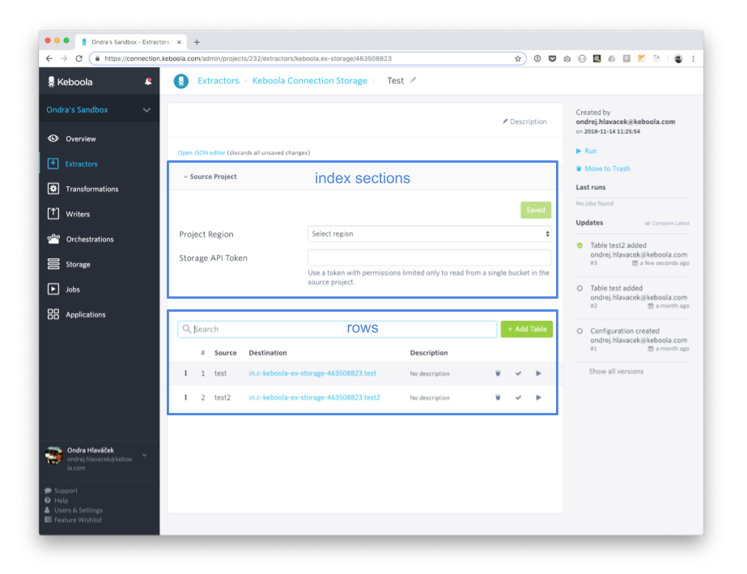
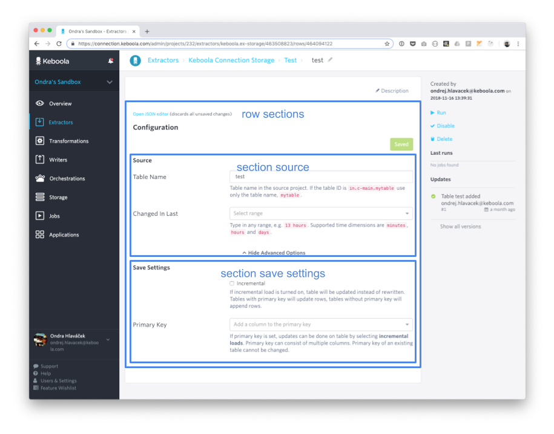
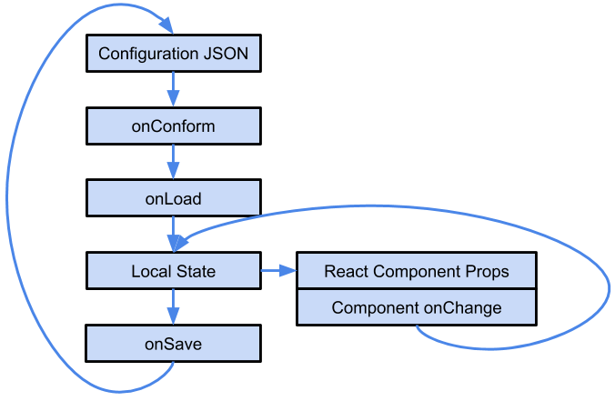
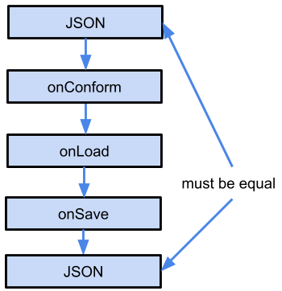

# Config Rows UI

Config Rows UI is a set of helpers to simply create a rich UI consistent with other components. All common features 
are taken care of, you only need to develop what's unique for your component. 

## Working Examples

You can use these components as great working examples. You can copy the whole component and start from there.

- [`keboola.ex-storage`](./src/scripts/modules/ex-storage)
- [`keboola.wr-storage`](./src/scripts/modules/wr-storage)

## Basic Principles

Config Rows UI employs hierarchical configurations. Each component can have any number of configurations and each 
configuration has any number of rows. The end user is allowed to run the whole configuration (all rows) or only 
a single row. 

This all is a logical wrapper - imagine a **configuration** being a database you want to connect to and a **row** a single 
table to be downloaded. 

### Structure

There is a common hierarchy and a fixed set of pages available

 - **Configuration detail**, also **index** - this is the main detail of the configuration where you set the credentials and other stuff 
 shared for all rows, it also contains a list of rows
 - **Configuration versions** - page of versions for the configuration
 - **Row detail**, also **row** - detail of a single row
 - **Row versions** - versions of a given row
   
Only the **Configuration detail** and **Row detail** pages are customizable.
 
### Sections



 
 
Both index and row pages can contain multiple sections. Each section is a logical and visual container for a form 
or other ways of visualising a part of the component configuration.

### Adapters
 
The UI usually needs to display configuration in a different way than it is finally stored in Storage (eg. a set 
of processors triggered in a single checkbox). 

Adapters allow you to create a mapping between the physical storage and the best way to display the configuration.
This mapping is 2 way - so any change in the configuration will result in a change in the UI and vice versa.



The raw configuration (stored in Storage) is referred to as **configuration**, 
the mapped configuration is referred to as **local state**.

In case the user wants to modify the configuration further than the UI allows, the form can be switched to a JSON input 
without any constraints. Configurations, that cannot be mapped successfully to the local state, will remain as JSON.

 
 

## Implementation

### Folder structure

The folder structure is very simple

```
routes.js 
adapters/*
react/components/*
```

- `routes.js` is the main configuration file
- `adapters/*` stores all adapters and their tests
- `react/components/*` stores all React components 
 
### `routes.js`

A sample `routes.js` file looks similar to this

```javascript
import createRoute from '../configurations/utils/createRoute';
import columnTypes from '../configurations/utils/columnTypeConstants';
import {
  createConfiguration as rowCreateConfiguration,
  parseConfiguration as rowParseConfiguration,
  createEmptyConfiguration as rowCreateEmptyConfiguration
} from './adapters/row';
import {
  createConfiguration as credentialsCreateConfiguration,
  parseConfiguration as credentialsParseConfiguration,
  isComplete as credentialsIsComplete
} from './adapters/credentials';
import ConfigurationForm from './react/components/Configuration';
import CredentialsForm from './react/components/Credentials';
import React from 'react';

const routeSettings = {
  componentId: 'keboola.ex-aws-s3',
  componentType: 'extractor',
  index: {
    sections: [
      {
          render: CredentialsForm,
          onSave: credentialsCreateConfiguration,
          onLoad: credentialsParseConfiguration
      }
    ]
  },
  row: {
    hasState: true,
    sections: [{
      render: ConfigurationForm,
      onSave: rowCreateConfiguration,
      onCreate: rowCreateEmptyConfiguration,
      onLoad: rowParseConfiguration
    }],
    columns: [
      {
        name: 'Name',
        type: columnTypes.VALUE,
        value: function(row) {
          return row.get('name') !== '' ? row.get('name') : 'Untitled';
        }
      },
      {
        name: 'Storage',
        type: columnTypes.TABLE_LINK_DEFAULT_BUCKET,
        value: function(row) {
          return row.get('tableName')
        }
      },
      {
        name: 'Description',
        type: columnTypes.VALUE,
        value: function(row) {
          return (
            <small>
              {row.get('description') !== '' ? row.get('description') : 'No description'}
            </small>
          );
        }
      }
    ]
  }
};

export default createRoute(routeSettings);

``` 

#### Basic Parameters

- `componentId` - eg `vendor.ex-mycomponent`
- `componentType` - `extractor` or `writer`, `writer` will let the user select a table from Storage when creating a new row
- `index.sections` - sections on the **index** page
- `index.actions` - component sync actions available for index page
- `row.sections` - sections on the **row** page
- `row.hasState` - if the component saves state a button will show in the UI to reset the state
- `row.columns` - columns of the rows table on the **index** page
- `row.actions` - component sync actions available for row page
      
##### `index.sections`

Each section has the following properties

- `render` - React component to display this section
- `onSave` - adapter function mapping **local state** to **configuration**
- `onLoad` - adapter function mapping **configuration** to **local state**

Example

```javascript
{
  render: CredentialsForm,
  onSave: credentialsCreateConfiguration,
  onLoad: credentialsParseConfiguration
}
``` 
 
##### `row.sections`

Same properties as `index.sections` with the addition of `onCreate`.

##### `row.columns`

Each column has these properties

- `name` - header of the column
- `type` - processes the return value of the `value` function
  - `TABLE_LINK_DEFAULT_BUCKET` - link to a table in Storage using default bucket
  - `TABLE_LINK` - link to a table in Storage
  - `VALUE` - displays the value without any further processing
- `value` - function to retrieve the column value from the row **configuration** (not **local state**)
 
Examples

```javascript
import columnTypes from '../configurations/utils/columnTypeConstants';
{
  name: 'Name',
  type: columnTypes.VALUE,
  value: function(row) {
    return row.get('name') !== '' ? row.get('name') : 'Untitled';
  }
}
```

```javascript
import columnTypes from '../configurations/utils/columnTypeConstants';
{
  name: 'Storage',
  type: columnTypes.TABLE_LINK_DEFAULT_BUCKET,
  value: function(row) {
    const processorMoveFiles = row.getIn(['configuration', 'processors', 'after'], Immutable.List()).find(
      function(processor) {
        return processor.getIn(['definition', 'component']) === 'keboola.processor-move-files';
      },
      null,
      Immutable.Map()
    );
    return processorMoveFiles.getIn(['parameters', 'folder']);
  }
},
````

#### Helpers

##### `CreateCollapsibleSection`

Creates a collapsible section that collapses once the required fields are filled in. Can be used in both index and row sections.

Properties

 - `title` - header of the section
 - `contentComponent` - React component
 - `options` 
   - `includeSaveButtons` - render save buttons
   - `stretchContentToBody` - stretch content to full width

Example

```javascript
import { CollapsibleSection } from '../configurations/utils/renderHelpers';
{
  render: CollapsibleSection({
    title: 'AWS Credentials',
    contentComponent: CredentialsForm,
    options: { includeSaveButtons: true }
  }),
  onSave: credentialsCreateConfiguration,
  onLoad: credentialsParseConfiguration,
  isComplete: credentialsIsComplete
}
```

The `CollapsibleSection` component can also accept `isComplete` property. `isComplete` is a function returning a `bool`, 
`true` means the section is completed and can be closed.  

Example

```javascript
export function isComplete(configuration) {
  return configuration.getIn(['parameters', 'accessKeyId'], '') !== '' && 
    configuration.getIn(['parameters', '#secretAccessKey'], '') !== '';
}
```

##### `onConform`

In case you need to make changes in the UI or configuration, always try to make the changes backwards compatible. 
In case this is not possible, `onConform` is a function, that can bring a small degree of flexibility to backwards 
compatibility. `onConform` function is executed on the **configuration** before it is passed to the **onLoad** adapter,
where it can mimic missing properties. Can be applied to both `index` and `row`

Example

```javascript
onConform: (configuration) => {
  const configDraft = fromJS({
    storage: {
      input: {
        tables: [
          {
            changed_since: ''
          }
        ]
      }
    },
    parameters: {
      incremental: false
    }
  });
  return configDraft.mergeDeep(configuration);
}
```

##### OAuth

OAuth section can be added for components that have OAuth support turned on.

Example

```javascript
import createOauthSection from '../configurations/utils/createOauthSection';
// ...
const routeSettings = {
  index: {
    sections: [
      createOauthSection()
      // ...
    ]
  }
};

```

### React Components

The React component of each section are very simple. They get passed the result of the `onLoad` adapter 
and can update it via a callback function.

**Example**

[Credentials.jsx](https://github.com/keboola/kbc-ui/blob/4b74daf9f5f8926d78ed9ce730007abb79b1a27b/src/scripts/modules/ex-http/react/components/Credentials.jsx)

**Properties**

- `onChange` - callback function that returns a key-value object for each changed property in the local state
- `disabled` - boolean if the whole component is disabled (eg. is saving)
- `value` - an object containing all local state props
- `actions` - an object containing all sync actions, optional 

#### `onChange`

`onChange` callback propagates input changes back to the local state.

**Example**

```jsx
<FormControl
  type="text"
  value={this.props.value.destination}
  onChange={function(e) {
    props.onChange({destination: e.target.value.trim()});
  }}
  placeholder="myfolder/file.csv"
  disabled={this.props.disabled}
/>
```

#### `actions`

Actions allow the UI use sync action from the component. Actions can be defined for `index` and `row` pages, `index` 
actions are also available in the `row` scope.  

##### Format

Action name serves as the key in the root object. 

- `status` - status of the action, `pending`, `success` or `error`
- `request` - body of the request
- `data` - body of the response
- `error` - error message from the response in case it is an user exception

**Success Example**

```javascript
{ 
  info: {
    status: 'success'
    request: {
      configData: {
        parameters: {
          url: 'myurl',
          '#token': '****'
        }
      }
    },
    data: {
      projectId: '12345',
      project: 'my project',
      bucket: 'in.c-mybucket'    
    }
  }
}
```

**Error Example**

```javascript
{ 
  info: {
    status: 'error',
    error: 'my error message'
  }
}
```

**Pending Example**

```javascript
{ 
  info: {
    status: 'pending'
  }
}
```

##### Usage

Actions is an Immutable.js map containing all current available information about all actions in the current scope.

**Example** 

Link to a Storage bucket in another project. The `SyncActionSimpleValue` takes care of any error or pending state that 
gets passed through. 

```jsx
<FormGroup>
  <Col componentClass={ControlLabel} sm={4}>
    Bucket
  </Col>
  <Col sm={8}>
    <FormControl.Static>
      <ExternalBucketLink
        stackUrl={this.props.actions.getIn(['info', 'request', 'configData', 'parameters', 'url'])}
        projectId={this.props.actions.getIn(['info', 'data', 'projectId'])}
        bucketId={this.props.actions.getIn(['info', 'data', 'bucket'])}
      >
        <SyncActionSimpleValue
          action={this.props.actions.get('info')}
          valueKey="bucket"
        />
      </ExternalBucketLink>
    </FormControl.Static>
  </Col>
</FormGroup>
```

##### Definition

Sync actions can be defined in `index` or `row` node.

- `name` - name of the action, serves to identify the action in the `actions` property
- `cache` - the results will be cached, cache id is derived from the request payload
- `autoload` - autoload actions will load automatically on each page view 
- `getPayload` - function that will generate the sync action payload

**Example**

```javascript
    actions: [
      {
        name: 'info',
        cache: true,
        autoload: true,
        getPayload: actions.info
      }
    ],
```

###### `getPayload`

The function returns an Immutable.js object with the body payload or `false`, if the action should not be executed.

- `index` actions have a single argument, `configuration` with the configuration
- `row` actions have two arguments, `configuration` and `row` with the respective configurations 

**Example**

```javasript
import Immutable from 'immutable';

const infoAction = function(configuration) {
  if (!configuration.hasIn(['parameters', '#token']) || !configuration.hasIn(['parameters', 'url'])) {
    return false;
  }
  return Immutable.fromJS({
    configData: {
      parameters: {
        '#token': configuration.getIn(['parameters', '#token'], ''),
        url: configuration.getIn(['parameters', 'url'], '')
      }
    }
  });
};

export default {
  info: infoAction
};
```

#### Helpers

A simple list of available helpers

- [`SyncActionSimpleValue`](./src/scripts/modules/configurations/react/components/SyncActionSimpleValue.jsx) - displays 
pending status of an action, error message or retrieved value
- [`ExternalProjectLink`](./src/scripts/modules/components/react/components/ExternalProjectLink.jsx) - link to 
another project
- [`ExternalBucketLink`](./src/scripts/modules/components/react/components/ExternalBucketLink.jsx) - link to 
a bucket in a different project
- [`CollapsibleSection`](./src/scripts/modules/configurations/utils/createCollapsibleSection.jsx) - dropdown 
section, can be collapsed by default when a condition is met
- [`createOauthSection`](./src/scripts/modules/configurations/utils/createOauthSection.js) - creates 
a collapsible OAuth section

### Adapters

Adapters serve to convert **configuration** to **local state** which is then passed to the React components, 
React components then change the **local state** and during save the process is reversed. 

Please note that except React components all other functions receive the **configuration**, not the **local state**.

Each React component should have its own set of adapters. All arguments and return values are Immutable.js maps.

**Example**

```javascript
export default {
  // onSave
  createConfiguration: function(localState) {
    const config = Immutable.fromJS({
      parameters: {
        url: localState.get('url', ''),
        '#token': localState.get('token', '')
      }
    });
    return config;
  },
  // onLoad
  parseConfiguration: function(configuration) {
    return Immutable.fromJS({
      url: configuration.getIn(['parameters', 'url'], ''),
      token: configuration.getIn(['parameters', '#token'], '')
    });
  }
}
```

#### `onSave`

The function receives data from the **local state** and produces the **configuration** or its part.

##### Merging

Multiple `onSave` adapters can write into the same `configuration` or its node. Result of all `onSave` adapters are deep 
merged in the order of their definition. 

#### `onLoad`

The function receives data from `configuration` or `row` and returns **local state** for the desired component, it is 
a reverse function to `onSave`.

#### `onCreate`

`onCreate` is one way adapter function that typically forwards directly to `onLoad` adapter function but is executed when
 a new row is added and creates default configuration to be stored in Storage. It accepts these arguments 
  - `name`, `webalizedName` for extractors
  - `tableId` for writers
  
**Extractor Example**

```javascript
import Immutable from 'immutable';
function createEmptyConfiguration(name, webalizedName) {
  return createConfiguration(Immutable.fromJS({name: webalizedName}));
}
``` 

**Writer Example**

```javascript
import Immutable from 'immutable';
export function createEmptyConfiguration(tableId) {
  const tableName = tableId.substr(tableId.lastIndexOf('.') + 1);
  return createConfiguration(Immutable.fromJS({source: tableId, destination: tableName + '.csv'}));
}
```

#### Testing

All adapters MUST have tests and the tests must cover each possible state of the **local state** 
([`keboola.ex-storage` example](./src/scripts/modules/ex-storage/adapters)).

## Integration

To make your component appear in the UI you need to

- have the component registered in [Developer Portal](https://components.keboola.com/)
- use the same component id for both Developer Portal and kbc-ui
- register the component in [`/src/scripts/modules/components/Routes.js`](/src/scripts/modules/components/Routes.js), 
it's easy, just follow examples

The component may or may not be visible in the list first, but you can easily point the browser in the right 
direction manually, eg. `/extractors/mycomponent`.

## Sources

- [Images on Google Drive](https://drive.google.com/drive/folders/1sbFNicLDL35c7n3xlBOMiZUGepfnLxID?usp=sharing)